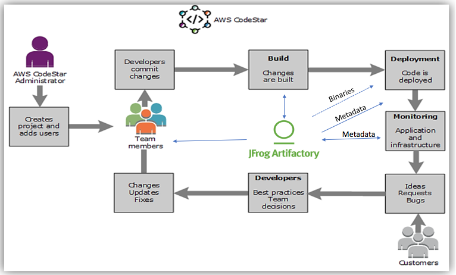
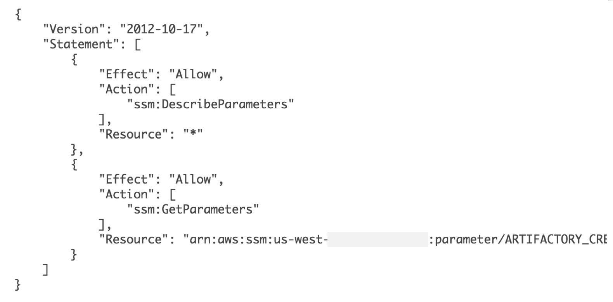

# CI/CD with AWSCodeStar and JFrog Artifactory 
This project includes the steps involved in configuring Artifactory as a source of truth for all types of binaries across multiple AWS CodeStar projects. 

The current use case is to build, containerize and deploy a Java based web application. In this use case, the dependencies (maven, docker) and tools are downloaded from JFrog Artifactory. The output binaries (maven, docker) along with the build info is pushed back to Artifactory. The deployment binaries are also pulled from Artifactory. 

This use case is implemented via two AWS CodeStar projects -

### Project 1: [demo-java-app](https://github.com/JFrogDev/aws-codestar/tree/master/demo-java-app)
This project is responsible to build a Java web application.

### Project 2: [demo-docker-framework](https://github.com/JFrogDev/aws-codestar/tree/master/demo-docker-framework)
This project is responsible to dockerize the web application build as part of the first project. 
In addition, the second project includes deployment scripts of the dockerized application.

### Pre-requisites:

1. Artifactory instance is available (URL, ApiKey)

2. Docker is pre-installed on the EC2 instance that is used to run project 2 (demo-docker-framework). This pre-req goes away once CodeDeploy integrates with ECS or something similar. 

### Note:

To authenticate with Artifactory instance, it is recommended **NOT** to use environment variables to inject passwords or ApiKey. Environment variable values are logged in plaintext as part of log files.

Instead, it is recommended to use ParameterStore and execute following steps:

a. Create and use SecureString in [ParameterStore](http://docs.aws.amazon.com/systems-manager/latest/userguide/systems-manager-paramstore.html).

b. Create a role policy under the CodeBuild service role. This allows CodeBuild to access the resources (variables) created under ParameterStore. More information can be found [here](http://docs.aws.amazon.com/systems-manager/latest/userguide/sysman-paramstore-access.html). 
A sample role policy to access a ParameterStore resource looks like -

