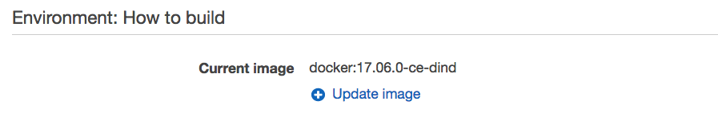
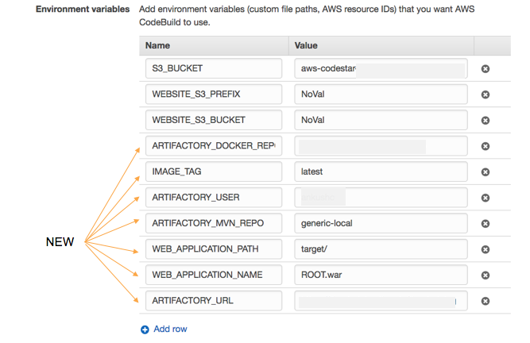

AWS CodeStar sample project scripts to dockerize webapplication
===============================================================

This project is responsible to dockerize a web application and then deploy (run) the dockerized application

What's Here
-----------

This sample includes:

* README.md - this file
* appspec.yml - this file is used by AWS CodeDeploy when deploying the web
  application to EC2
* buildspec.yml - this file is used by AWS CodeBuild to build the web
  application
* scripts/ - this directory contains scripts used by AWS CodeDeploy when
  installing and deploying your application on the Amazon EC2 instance

How to integrate with Artifactory?
----------------------------------
* Use the buildspec.yml and appspec.yml i.e. part of this project.
* Update CodeBuild (AWSCodeStar->$PROJECT->CodeBuild->Edit Project) to set the builder image to point to dind version

* Update CodeBuild (AWSCodeStar->$PROJECT->CodeBuild->Edit Project->Show advanced settings) to set the *Privileged* flag

* Add new environment variables (AWSCodeStar->$PROJECT->CodeBuild->Edit Project->Show advanced settings)

| Environment Variables | Description |
| --------------------- | ----------- |
| ARTIFACTORY_URL | Artifactory URL |
| ARTIFACTORY_USER | Artifactory user |
| ARTIFACTORY_DOCKER_REPO | Artifactory Docker virtual repository  |
| ARTIFACTORY_MVN_REPO | Virtual Maven repository in Artifactory |
| WEB_APPLICATION_PATH | Path of the web application within repository |
| WEB_APPLICATION_NAME | Name of the web application that needs to be containerized |
| ARTIFACTORY_DOCKER_REPO | Virtual docker repository in Artifactory |
| IMAGE_TAG | Dynamic Tag of the docker image that should be set. In addition, a static tag will be set for the newly created docker image |
 

* Create a ParameterStore resource (SecureString). In this sample, this resource is named as *ARTIFACTORY_CREDENTIALS*. In addition, to access this resource, the role policy needs to be added under the CodeBuild service role. Additional information is located [here](https://github.com/JFrogDev/aws-codestar/tree/master/#note)
~                     

