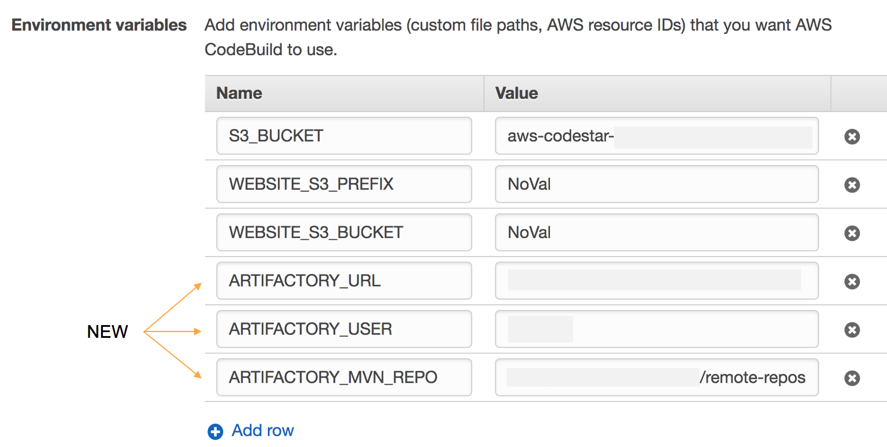

AWS CodeStar : Building Java web application
============================================

This sample code helps get you started with a simple Java web application build by AWS CodeBuild with Artifactory as a source of truth. This web application will then be containerized and deployed as part of a different project.

What's Here
-----------

This sample includes:

* README.md - this file
* buildspec.yml - this file is used by AWS CodeBuild to build the web
  application
* settings.xml - this file is used by maven to pull all dependencies from an authenticated Artifactory instance

How to integrate with Artifactory?
----------------------------------
* Use the buildspec.yml and settings.xml i.e. part of this project.
* Update CodeBuild (AWSCodeStar->$PROJECT->CodeBuild->Edit Project->Show advanced settings) to inject 3 new environment variables

| Environment Variables | Description |
| --------------------- | ----------- |
| ARTIFACTORY_URL | Artifactory URL  |
| ARTIFACTORY_USER| Artifactory user |
| ARTIFACTORY_MVN_REPO | Virtual Maven repository in Artifactory |

* The dockerized builder agent can also be pulled from Artifactory or Bintray (AWSCodeStar->$PROJECT->CodeBuild->Edit Project->Build Environment). Note that CodeBuild doesn't allow a mechanism to authenticate with external docker repositories to download the dockerized builder agent. Once a mechanism is available, public repositories should be used.

* Create a ParameterStore resource (SecureString). In this sample, this resource is named as *ARTIFACTORY_CREDENTIALS*. In addition, to access this resource, the role policy needs to be added under the CodeBuild service role. Additional information is located [here](https://github.com/JFrogDev/soldev/tree/master/AWSCodeStar#note) 
